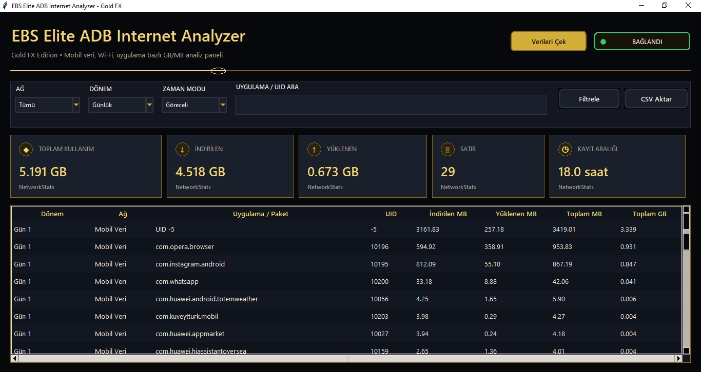

# Global EBS ADB Internet Analyzer

**Global EBS ADB Internet Analyzer**, Android / Huawei cihazlarda ADB üzerinden mobil veri ve Wi‑Fi kullanımını uygulama bazında analiz eden modern masaüstü GUI aracıdır.

## Özellikler

- Mobil Veri / Wi‑Fi / Tümü filtreleme
- Saatlik, günlük, aylık, yıllık ve toplam kullanım analizi
- Uygulama adı ve UID bazlı listeleme
- İndirilen, yüklenen ve toplam MB/GB gösterimi
- Göreceli zaman modu ve gerçek tarih modu
- CSV dışa aktarma
- Altın/siyah modern Gold FX arayüz
- Huawei Pura 70 Ultra ve Android tabanlı cihazlarla uyumlu ADB analizi

## Ekran Görünümü

> Görsel eklemek için GitHub reposuna bir ekran görüntüsü yükleyip buraya ekleyebilirsiniz.





## Gereksinimler

- Windows
- Python 3.10 veya üzeri
- ADB kurulu olmalı
- Telefon geliştirici seçeneklerinden **USB hata ayıklama** açık olmalı

## Kurulum

Projeyi indirin:

```bash
git clone https://github.com/ebubekirbastama/global-ebs-adb-internet-analyzer.git
cd global-ebs-adb-internet-analyzer
```

Python dosyasını çalıştırın:

```bash
python global_ebs_adb_internet_analyzer.py
```

## ADB Kontrolü

Önce cihazın ADB tarafından görüldüğünü kontrol edin:

```bash
adb devices
```

Cihaz listede şu şekilde görünmelidir:

```text
XXXXXXXX	device
```

## Kullanım

1. Telefonu USB ile bilgisayara bağlayın.
2. Telefonda USB hata ayıklama iznini onaylayın.
3. Programı başlatın.
4. **Verileri Çek** butonuna basın.
5. Ağ türünü seçin:
   - Tümü
   - Mobil Veri
   - Wi‑Fi
6. Dönem seçin:
   - Saatlik
   - Günlük
   - Aylık
   - Yıllık
   - Toplam
7. İsterseniz CSV olarak dışa aktarın.

## Zaman Modları

### Göreceli

Huawei ve bazı Android cihazlarda `netstats` zaman damgaları gerçek tarih gibi davranmayabilir. Bu durumda kayıtlar **Gün 1, Gün 2, Saat 1** gibi göreceli olarak listelenir.

### Gerçek Tarih

Android timestamp değerleri gerçek tarih ile uyumluysa bu mod kullanılabilir.

## Notlar

Bu araç Android `dumpsys netstats` çıktısını analiz eder. Operatör fatura sistemiyle birebir aynı sonuç vermeyebilir.

## Kullanılan ADB Komutları

```bash
adb shell cmd package list packages -U
adb shell dumpsys netstats detail
```


